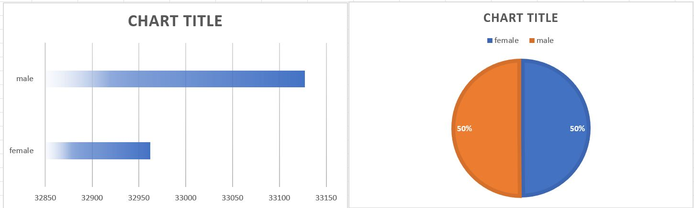

# Arnav-GenderMarks
## Dataset
Link: [Raw Dataset](https://www.kaggle.com/spscientist/students-performance-in-exams)
## About Data: 
This data set consists of the marks secured by the students in various subjects.

## Findings: 
By using the mapper and reducer scripts I have processed the data of 1000 records to 2 records by grouping the genders from the dataset which has the grades of each student on basis of gender and group. By considering the data, both the genders has same student performance as shown in the below charts.

## Chart: 
## Student Performance by Gender: 

